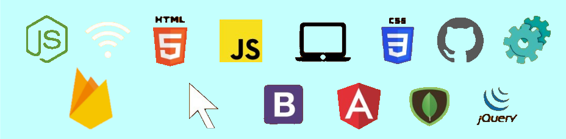

 # ✨ Développeur JS   Fullstack
#### Ma stack :   

 

🎓 Diplôme RNCP niv 6 en développement web obtenu à [Ifocop 🚀](https://www.ifocop.fr/formations-metiers/web-digital/formation-developpeur-full-stack-js/)  
 
🥋 4ème Kyu en kata JS [   
  
🔎 Technos en cours d'exploration : React / React Native / Flutter   
 

 
 

